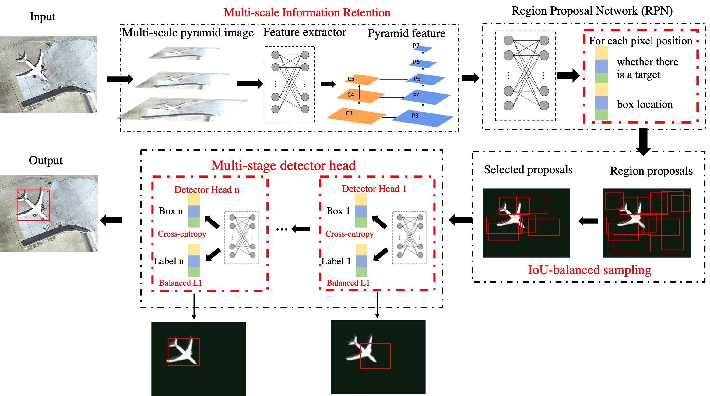
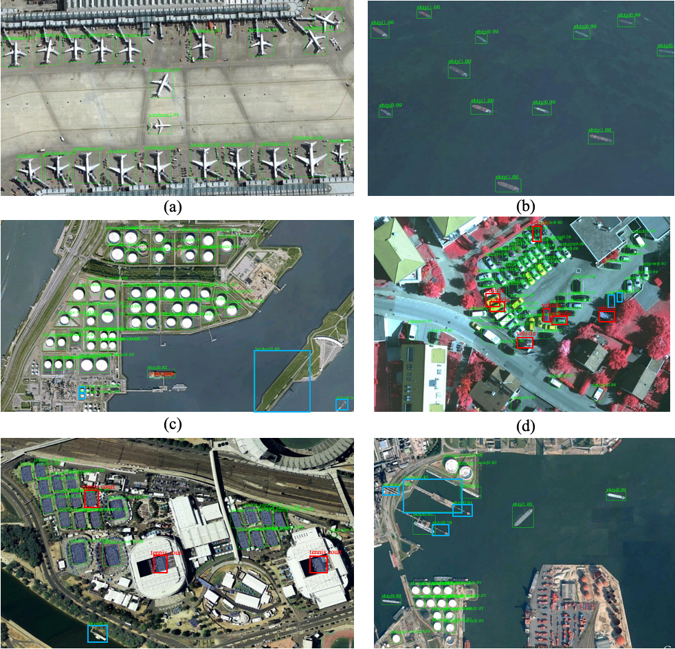

# Sampling-Balance_Multi-stage_Network

This code is to replicate the expeirments from the paper [Improving Training Instance Quality in Aerial Image Object 
Detection with A Sampling-balance based Multi-stage Network](https://ieeexplore.ieee.org/document/9281082)

## 1. Introduction

This network is built based on Pytorch 1.1 and MMdetection v1.0rc1

Please refer to [INSTALL.md](docs/INSTALL.md) to install the MMdetection framework. It should be noted that a correct 
version of MMdetection should be download first, which can ensure the codes to be executable.

You should first prepare the used dataset as VOC format. 

Three datasets NWPU-VHR10, DIOR, HRRSD are implemented in the branch. If you use one of them, you can set 

dataset_type = 'VOCDataset'  # for NWPU10

dataset_type = 'HRRSD_Dataset' # for HRRSD
dataset_type = 'DOIR_Dataset'  # for DIOR

[The codes](/configs/0.%20TGRS-sampling-balance-detector) can repreduce the expeiremnts in the paper.


## 2. The overall architecture of the proposed detector.


## 3. Some prediction examples of the proposed method on the NWPU VHR-10 data set (Green boxes are the correct predictions. Blue boxes are the false predictions. Red boxes are the missing predictions).



## Citation

If you use this method in your research, please cite this paper.

```
@article{SBNet,
  title   = {Improving Training Instance Quality in Aerial Image Object 
             Detection With a Sampling-Balance-Based Multistage Network},
  author  = {Wei Han, Runyu Fan, Lizhe Wang, Ruyi Feng, Fengpeng Li, 
             Ze Deng, and Xiaodao Chen},
  journal = {{IEEE} Trans. Geosci. Remote. Sens.}, 
  doi     = {10.1109/TGRS.2020.3038803},
  year    = {2020},
  pages   = {1-15}
}
```

